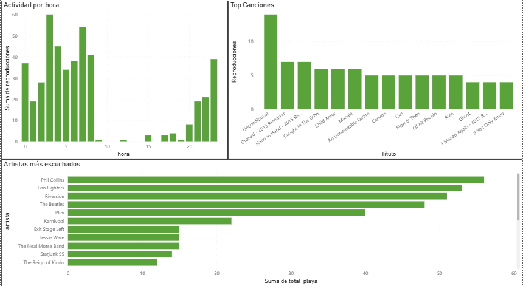

# Spotify Data Pipeline


Proyecto de un Pipeline ETL automatizado que utiliza la API de Spotify para extraer el historial de reproducciones, se almacena en PostgreSQL y analiza patrones de escucha mediante SQL.

---

## Motivación

LA creación de este proyecto fue debido a dos razones: practicar mis habilidades de extracción de datos, y mi motivación por escuchar música, me lleva a querer descubrir mis patrones de escucha durante un tiempo prolongado- Cuándo escucho música, qué tipo de artistas consumo en rachas o de forma distribuida, y cómo corresponden mis sesiones.

---

## Stack técnico

- **Python 3.11** — lógica del pipeline
- **PostgreSQL** — almacenamiento persistente (hosteado en Railway)
- **psycopg2** — conexión a la base de datos
- **requests** — consumo de la API de Spotify
- **python-dotenv** — manejo de variables de entorno
- **Windows Task Scheduler** — automatización de ejecución cada hora

---

## Arquitectura

```
Spotify API
    │
    ▼
[Extract]  etl/extract/auth.py       → OAuth con refresh token
           etl/extract/history.py    → GET /me/player/recently-played
    │
    ▼
[Transform] etl/transform/history_transform.py → limpieza y normalización
                                               → separación en tracks y eventos
    │
    ▼
[Load]     etl/load/database.py      → INSERT en PostgreSQL (idempotente)
    │
    ▼
PostgreSQL
├── tracks           (canciones únicas)
└── listening_history (eventos de reproducción)
```

El pipeline es **idempotente**: usa `ON CONFLICT DO NOTHING` en todas las inserciones. Ejecutarlo múltiples veces no genera duplicados.

---

## Estructura del proyecto

```
spotify-data-pipeline/
│
├── etl/
│   ├── extract/
│   │   ├── auth.py          # OAuth: refresh token → access token
│   │   └── history.py       # Extracción desde Spotify API
│   │
│   ├── transform/
│   │   └── history_transform.py  # Limpieza y split de entidades
│   │
│   └── load/
│       └── database.py      # Conexión y carga a PostgreSQL
│
├── pipeline/
│   └── run_pipeline.py      # Orquestador principal
│
├── logs/
│   └── pipeline.log         # Output de ejecuciones automáticas
│
├── init_db.py               # Crea las tablas (ejecutar solo una vez)
├── run_pipeline.bat         # Script para Task Scheduler
├── .env                     # Variables de entorno (no incluido en repo)
└── requirements.txt
```

---

## Cómo correrlo localmente

### 1. Requisitos previos

- Python 3.11+
- PostgreSQL instalado y corriendo
- Cuenta de desarrollador en [Spotify Developer Dashboard](https://developer.spotify.com/dashboard)

### 2. Clonar el repositorio

```bash
git clone https://github.com/IgnacioP2112/spotify-data-pipeline.git
cd spotify-data-pipeline
```

### 3. Crear entorno virtual e instalar dependencias

```bash
python -m venv .venv
.venv\Scripts\activate      # Windows
pip install -r requirements.txt
```

### 4. Configurar variables de entorno

Crear un archivo `.env` en la raíz con:

```
SPOTIFY_CLIENT_ID=tu_client_id
SPOTIFY_CLIENT_SECRET=tu_client_secret
SPOTIFY_REDIRECT_URI=http://localhost:8888/callback
SPOTIFY_REFRESH_TOKEN=tu_refresh_token

DB_NAME=spotify_db
DB_USER=tu_usuario
DB_PASSWORD=tu_contraseña
DB_HOST=localhost
DB_PORT=5432
```

Para obtener el `REFRESH_TOKEN`, ejecutar una vez:

```bash
python etl/extract/auth.py
```

### 5. Inicializar la base de datos

```bash
python init_db.py
```

### 6. Ejecutar el pipeline

```bash
python pipeline/run_pipeline.py
```

---

## Automatización

El pipeline está configurado para correr automáticamente cada hora mediante **Windows Task Scheduler**, usando `run_pipeline.bat`. Esto permite acumular datos de forma continua sin intervención manual.

---

## Decisiones técnicas

**¿Por qué separar `init_db.py` del pipeline?**
La creación de tablas es infraestructura, no parte del flujo de datos. Mezclarlos haría el pipeline menos predecible y más difícil de depurar.

**¿Por qué `ON CONFLICT DO NOTHING` y no `UPSERT`?**
Los datos de Spotify son inmutables — una reproducción ocurrida no cambia. No tiene sentido actualizar registros existentes. `DO NOTHING` es más honesto con la naturaleza del dato.

**¿Por qué no usar Airflow?**
El pipeline tiene un solo flujo lineal y corre en una sola máquina. Airflow agrega complejidad sin valor real en este contexto. Task Scheduler cumple el mismo rol sin overhead.

**¿Por qué Railway?**
Mover PostgreSQL a la nube permite que los datos persistan independientemente 
de la máquina local y demuestra manejo de bases de datos remotas con credenciales 
seguras via variables de entorno.

---

## Análisis SQL

Con los datos acumulados es posible responder preguntas no triviales sobre el comportamiento de escucha.

**Detección de sesiones de escucha** (usando window functions):

```sql
WITH ordered AS (
  SELECT played_at,
         LAG(played_at) OVER (ORDER BY played_at) AS prev_played_at
  FROM listening_history
),
sessions AS (
  SELECT played_at,
         CASE WHEN prev_played_at IS NULL
                OR played_at - prev_played_at > INTERVAL '30 minutes'
              THEN 1 ELSE 0 END AS new_session
  FROM ordered
),
numbered AS (
  SELECT played_at,
         SUM(new_session) OVER (ORDER BY played_at) AS session_id
  FROM sessions
)
SELECT session_id,
       MIN(played_at) AS inicio,
       MAX(played_at) AS fin,
       COUNT(*)        AS canciones,
       MAX(played_at) - MIN(played_at) AS duracion
FROM numbered
GROUP BY session_id
ORDER BY duracion DESC;
```

**Artistas escuchados en rachas vs. de forma distribuida:**

```sql
SELECT t.artist_name,
       COUNT(*)                                      AS total_plays,
       COUNT(DISTINCT DATE(lh.played_at))            AS dias_distintos,
       ROUND(COUNT(*)::numeric /
             COUNT(DISTINCT DATE(lh.played_at)), 2)  AS plays_por_dia
FROM listening_history lh
JOIN tracks t ON lh.track_id = t.track_id
GROUP BY t.artist_name
HAVING COUNT(*) > 3
ORDER BY plays_por_dia DESC;
```

**Actividad por hora del día:**

```sql
SELECT EXTRACT(HOUR FROM played_at) AS hora,
       COUNT(*)                      AS reproducciones
FROM listening_history
GROUP BY hora
ORDER BY hora;
```

---

## Hallazgos preliminares

Con datos acumulados durante las primeras dos semanas (397 eventos, 12 días distintos):

**Patrón nocturno consistente**
El 75% de las reproducciones ocurren entre las 2:00 y las 8:00 AM.
No es un patrón aislado — se repite en todos los días con datos.


**Sesiones de escucha largas**
La sesión más larga registrada duró 4 horas 30 minutos (42 canciones continuas).
El promedio de las 10 sesiones más largas supera las 2 horas.
Todas ocurren en horario nocturno o madrugada.

**Deep listening — repetición intencional en sesiones distintas**
Las canciones más escuchadas no aparecen en loop dentro de una misma sesión,
sino distribuidas en múltiples sesiones distintas. "Unconditional" (Foo Fighters)
fue escuchada 14 veces en 5 sesiones diferentes — indicando escucha activa
y atencional, no reproducción pasiva.



---

## Autor

**Ignacio Pérez Núñez**
Ingeniero Civil Telemático
[LinkedIn](https://linkedin.com/in/ignaciopereznunez2112) · [GitHub](https://github.com/IgnacioP2112)
